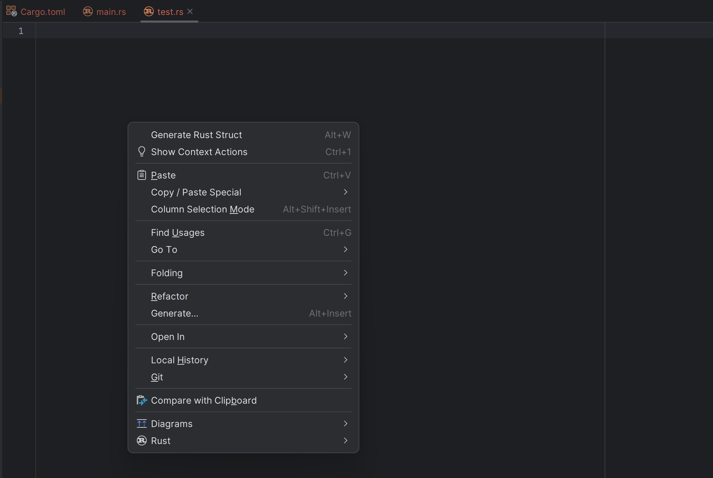

    
    <h1>RustJson</h1>
    
<b>A Json to Rust Struct Idea Plugin.</b>

    
    
    
    
   
[English]<a href="README_CN.md">[简体中文]</a>

**NOTE: The current version is a test version, there may be some problems, welcome to put forward valuable
suggestions.**

## Features

Convert Json to Rust Struct.

* Support `debug` derive
* Support `serde` derive
* Support `serde` rename

## Screenshots

   
   
   

## Usage

1. Open JetBrains IDE, such
   as `IntelliJ IDEA` / `PyCharm` / `WebStorm` / `GoLand` / `CLion` / `Rider` / `DataGrip` / `RubyMine` / `PhpStorm` / `AppCode` / `Android Studio`
   and so on.
2. Settings -> Plugins -> Marketplace -> Search `RustJson` -> Install
3. Open any file
4. Press `Alt + W`  to open the window or right click to open the context menu and select `Generate Rust Struct`
5. Input Json text and press `OK`

## Give me a Cup of Coffee

And you can also give me a cup of coffee by scanning the QR code below.

| Paypal                                                  | Wechat                                     | Alipay/AlipayHK                            |
|---------------------------------------------------------|--------------------------------------------|--------------------------------------------|
| [**`Paypal`**](https://www.paypal.com/paypalme/haoyu94) |  |  |

## For Developer

1. Install `IntelliJ 2023`
2. Clone the project
3. Build the project

## Feedback

If you have any questions, please submit an issue. And you can also follow my WeChat Official Account by scanning the QR
code below.

## License

AGPLv3