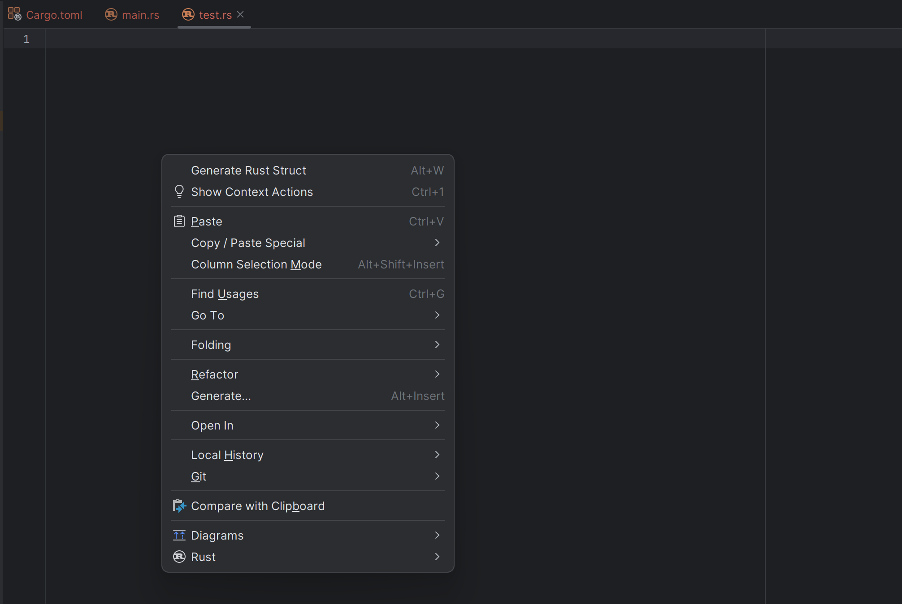
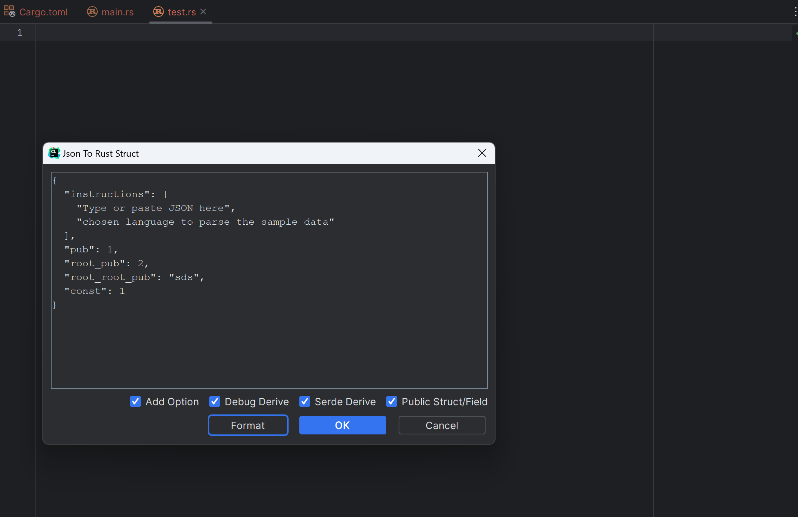
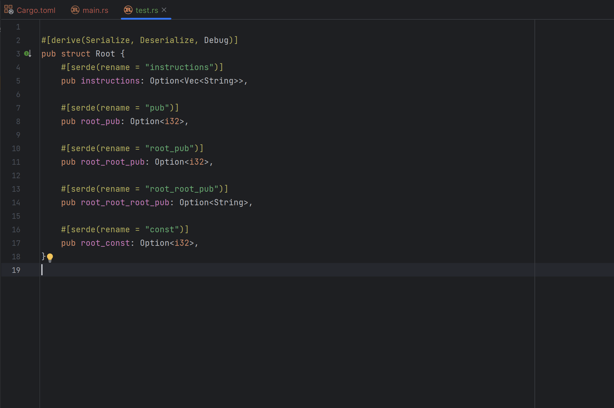

    
    <h1>RustJson</h1>
    
<b>一个 Json 转 Rust Struct 的 Idea 插件.</b>

    
    
    
    
   
<a href="README.md">[English]</a>[简体中文]

注意: 当前版本为测试版本，可能存在一些问题，欢迎提出宝贵的建议。

## 特性

将 Json 转换为 Rust Struct。

* 支持 `debug` 派生
* 支持 `serde` 派生
* 支持 `serde` 重命名

## 演示

   
   
   

## 使用方法

1. 打开 JetBrains IDE, 例如 `IntelliJ IDEA` / `PyCharm` / `WebStorm` / `GoLand` / `CLion` / `Rider` / `DataGrip` / `RubyMine` / `PhpStorm` / `AppCode` / `Android Studio` 等等。
2. 设置 -> 插件 -> 市场 -> 搜索 `RustJson` -> 安装
3. 打开任意文件
4. 按下 `Alt + W` 打开窗口或右键打开上下文菜单并选择 `Generate Rust Struct`
5. 输入 Json 文本并按下 `OK`

## 请我喝杯咖啡

你也可以通过扫描下面的二维码给我买杯咖啡。

| Paypal                                                  | Wechat                                     | Alipay/AlipayHK                            |
|---------------------------------------------------------|--------------------------------------------|--------------------------------------------|
| [**`Paypal`**](https://www.paypal.com/paypalme/haoyu94) |  |  |

## 开发者

1. 安装 `IntelliJ 2023`
2. 克隆项目
3. 构建项目

## 问题反馈

如果您有任何问题，请提交 `Issues`。您也可以通过扫描下面的二维码关注我的微信公众号。

## 许可证

AGPLv3

